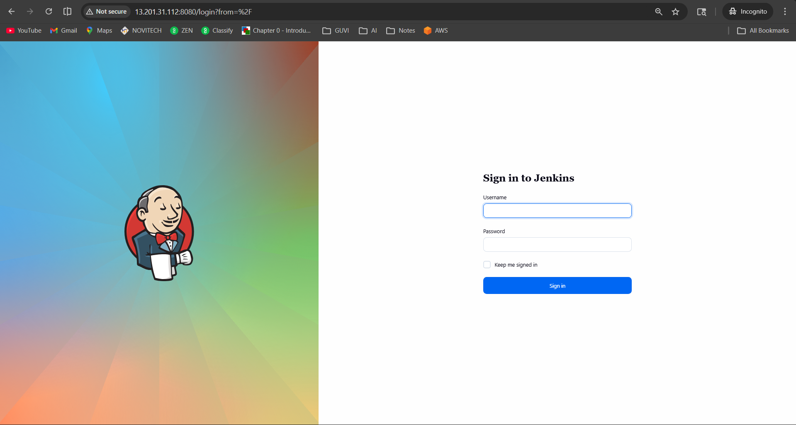
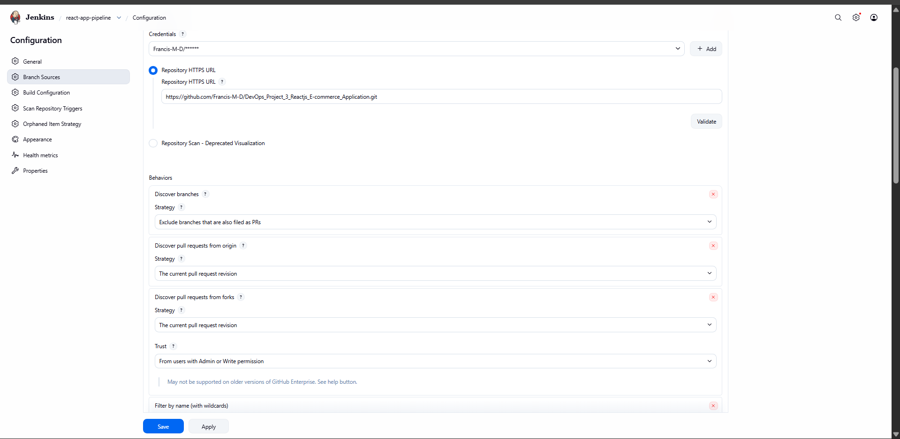
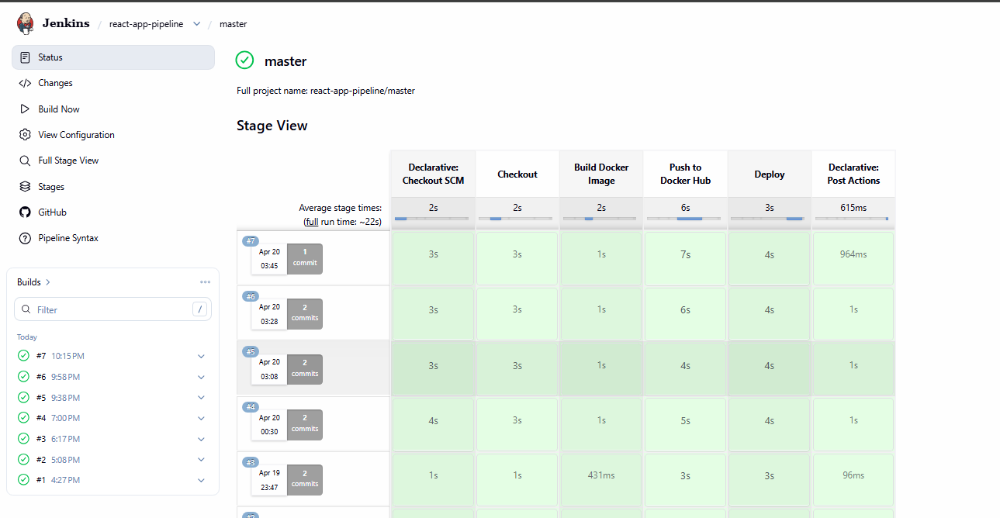
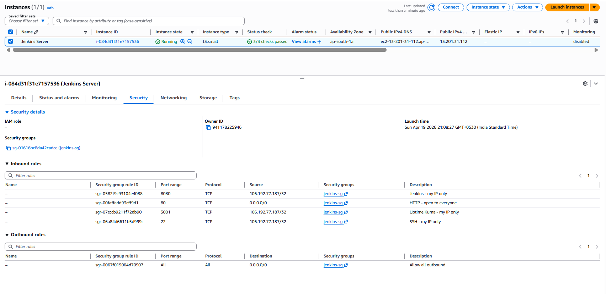
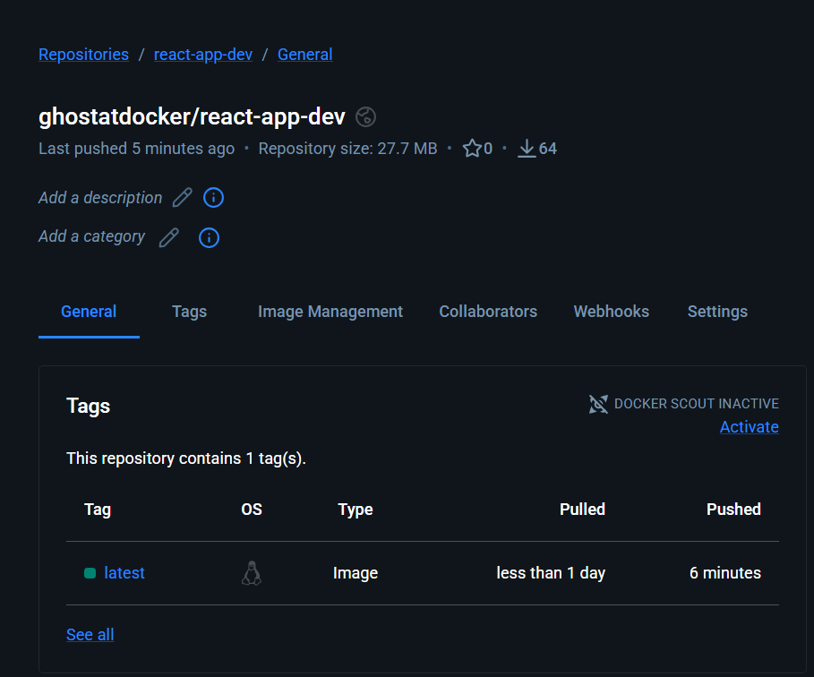
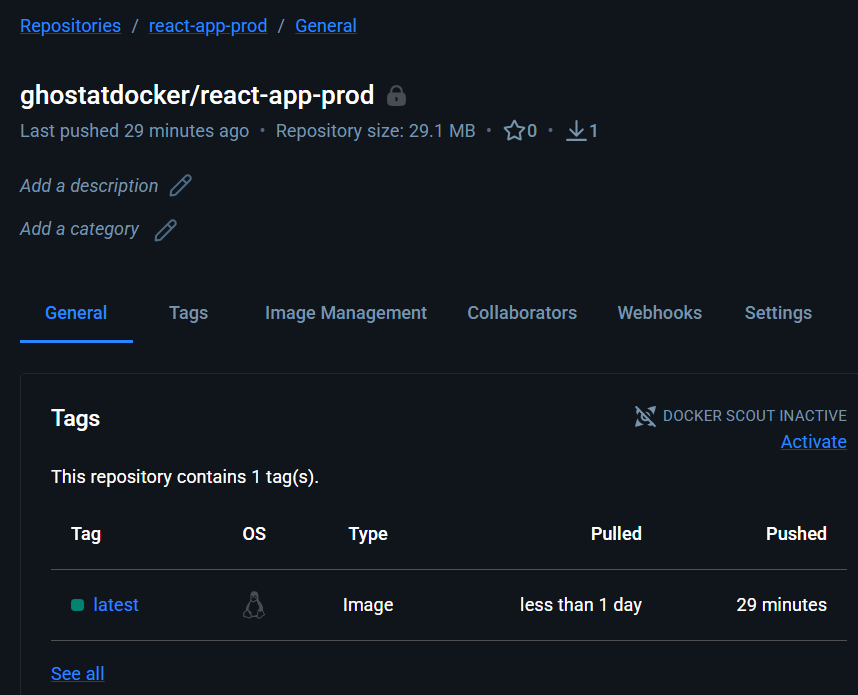
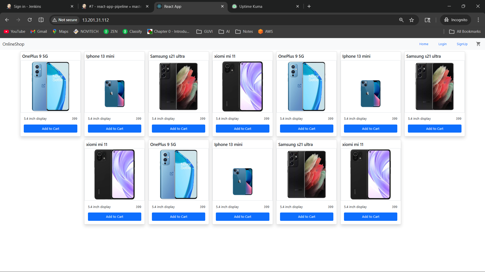
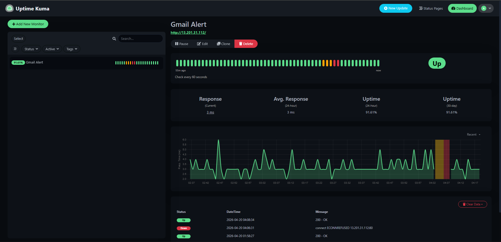

# 🚀 DevOps Project 3 – ReactJS E-Commerce Application Deployment

---
## 📌 Project Overview
```
This project demonstrates a **production-ready DevOps pipeline** for deploying a ReactJS application using:

- Docker & Docker Compose
- Jenkins CI/CD Pipeline
- AWS EC2 Deployment
- Docker Hub (Dev & Prod Repos)
- Monitoring using Uptime Kuma

The application is containerized, automated, and deployed on AWS with full CI/CD integration.
```

---
## 🏗️ Architecture

```
GitHub (dev / master)
        ↓
     Jenkins (CI/CD)
        ↓
   Docker Build
        ↓
Docker Hub (dev / prod)
        ↓
AWS EC2 Deployment (Port 80)
        ↓
Monitoring (Uptime Kuma)
```
---

## 📂 Project Repository

```
GitHub Repo:
https://github.com/Francis-M-D/DevOps_Project_3_Reactjs_E-commerce_Application.git
```

---

## 🌐 Deployed Application

```
http://13.201.31.112/
```

---

## 🐳 Docker Hub Repositories

```
Dev Repository  : ghostatdocker/react-app-dev   (Public)
Prod Repository : ghostatdocker/react-app-prod  (Private)
```

---

# ⚙️ Setup & Implementation

---

## 1️⃣ Application Setup

Clone the source repo and remove the original git history to make it local:

```
git clone https://github.com/sriram-R-krishnan/devops-build.git
cd devops-build
rm -rf .git
```

The app is already in a pre-built state. No npm build required.

---

## 📂 Project File Structure

```
DevOps_Project_3_Reactjs_E-commerce_Application/
├── Dockerfile
├── docker-compose.yml
├── build.sh
├── deploy.sh
├── Jenkinsfile
├── .dockerignore
├── .gitignore
├── README.md
└── devops-build/
    └── build/
```

---

## 2️⃣ Docker Configuration

### 🔹 Dockerfile

- Uses nginx:alpine as the base image
- Copies the pre-built React app into nginx's serving directory
- Exposes port 80

---

### 🔹 Docker Compose

```
docker-compose up -d
```

Application runs on:

```
http://localhost:80
```

---

## 3️⃣ Bash Scripts

### 🔹 Build Script

```
bash build.sh
```

- Builds the Docker image
- Tags it as ghostatdocker/react-app-dev:latest

---

### 🔹 Deploy Script

```
bash deploy.sh
```

- Stops the running container
- Pulls the latest image from Docker Hub
- Starts the container on port 80

---

## 4️⃣ Version Control (CLI Only)

```
git init
git remote add origin https://github.com/Francis-M-D/DevOps_Project_3_Reactjs_E-commerce_Application.git
git checkout -b dev
git add .
git commit -m "Initial commit - Dockerized React app"
git push origin dev
```

---

## 5️⃣ Docker Hub Setup

Two repositories created on Docker Hub:

| Repo | Visibility | Purpose |
|---|---|---|
| ghostatdocker/react-app-dev | Public | Dev branch builds |
| ghostatdocker/react-app-prod | Private | Production builds |

---

## 6️⃣ Jenkins CI/CD

### 🔹 Features Implemented

- Jenkins installed on EC2 instance
- Auto-trigger via GitHub webhook
- Branch-based pipeline logic:

| Branch | Action |
|---|---|
| dev | Build image → Push to react-app-dev repo |
| master | Tag image → Push to react-app-prod repo |

- Automated deployment to EC2 via deploy.sh

---

## 🔔 Jenkins Screenshots

### 🔹 Jenkins Login Page



### 🔹 Jenkins Job Configuration



### 🔹 Jenkins Build Console Output



---

## 7️⃣ AWS Deployment

### 🔹 EC2 Configuration

| Setting | Value |
|---|---|
| Instance Type | t3.micro |
| Region | ap-south-1 (Mumbai) |
| OS | Ubuntu 22.04 LTS |
| Storage | 20 GB |

---

### 🔐 Security Group Rules

| Port | Protocol | Access | Purpose |
|---|---|---|---|
| 80 | HTTP | 0.0.0.0/0 | Public app access |
| 8080 | TCP | My IP only | Jenkins dashboard |
| 22 | SSH | My IP only | Server login |

---

## ☁️ AWS Screenshots

### 🔹 EC2 Dashboard | Security Group Configuration




---

## 8️⃣ Docker Hub Screenshots

### 🔹 Dev Repository



### 🔹 Prod Repository



---

## 🌍 Deployed Application

### 🔹 Live Site



---

## 📊 Monitoring Setup

- **Tool:** Uptime Kuma (open-source, self-hosted)
- Runs as a Docker container on the same EC2 instance
- Monitors the app on port 80 every 60 seconds
- Sends alert notification only when the app goes **down**

```
Uptime Kuma Dashboard:
http://13.201.31.112/:3001
```

---

## 📈 Monitoring Screenshots

### 🔹 Uptime Kuma Health Check



---

# 🧹 Cleanup

After project completion, remove all resources to avoid AWS charges.

### 🔥 Docker Cleanup

```
docker stop $(docker ps -aq)
docker rm $(docker ps -aq)
docker rmi $(docker images -q)
docker volume rm $(docker volume ls -q)
docker network prune -f
docker system prune -a -f
```

### ☁️ AWS Cleanup

- Terminate the EC2 instance
- Delete the Security Group
- Release the Elastic IP (if allocated)

---

# 📸 Submission Checklist

- Jenkins screenshots ✅
- AWS EC2 & Security Group screenshots ✅
- Docker Hub repo with image tags ✅
- Deployed site screenshot ✅
- Monitoring health check screenshot ✅
- GitHub repo link ✅
- Deployed site URL ✅
- Docker Hub image names ✅

---

# 💡 Key Highlights

- Pre-built React app served via nginx in Docker
- CI/CD with branch-based deployment logic
- Production deployment on AWS EC2 (ap-south-1)
- Separate Docker Hub repos for dev and prod
- Automated build and deploy via shell scripts
- Health monitoring with instant down-alerts

---
# 🧑‍💻 Author

**Maria Francis D**

---
